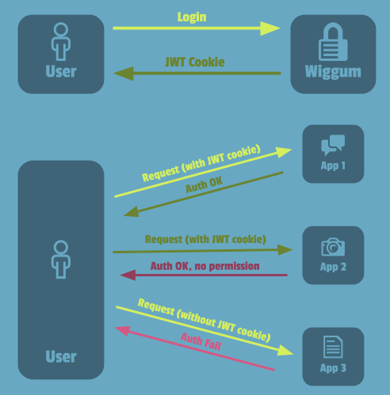

Wiggum
=======

A modern centralized authentication and authorization system based on JWT.

Wiggum started with the need of a centralized auth system for all QDQMedia applications in order
to let the client (and QDQMedia workers) do the login once and access to all of our products.
