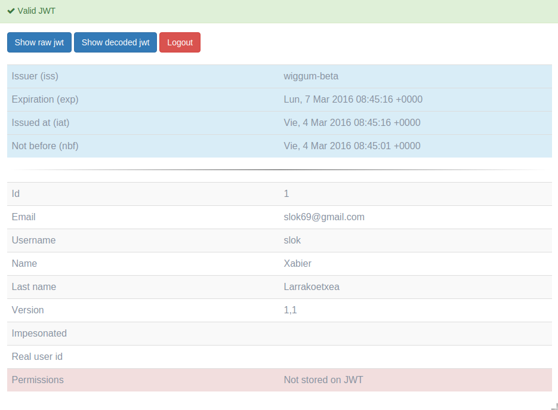

> *Authentication: is the act of confirming the truth of an attribute of a single piece of data (a datum) claimed true by an entity*

> From the [wikipedia]

[wikipedia]: https://en.wikipedia.org/wiki/Authentication

# Login

When you enter in `a/login` url of a wiggum endpoint you will see the main
form. You can force a redirect using querystring, by default you can use `next`
or `redirect_uri`. For example: `a/login?next=http://myapp.com/welcome`

If the login is correct, wiggum will create a JWT token and will set on the cookie.
if cloning cookie across domain is enabled, a chain of redirects will happen to set
the cookie on all the domains

# Logout

To logout you need to enter in `a/logout` this will logout (delete the cookie)
from user session, if clone across domain is enabled, a chain of redirects will
happend to remove the cookie from all the domains.

As with Login a redirect querystring can be pass in the url so wigumm redirects the
user after a successful logout. For example: `a/logout?next=http://myapp.com/goodbye`

# Password reset

Wiggum implements password reset, this has to be done in two steps, first you need
to request a password recovery by entering your email on `a/recover-password`. This
will generate a password reset token and URL with the form: `a/reset-password/1/b3297c67-ec25-4625-af56-1f14dfb1d5d4`

This URL at this moment isn't sent by
email because this link can be send in many ways, so is up to the developer to
implement and customize a send URL action as you will see in [customization section].

The generated token will last to the time the setting `PASSWORD_RESET_EXPIRE_DELTA` is set and after the first use the token will be invalidated

[customization section]: custom/actions

# Check JWT cookie is correct

Wiggum has included a very handy endopint to check the JWT wiggum cookie is set
correctly. After login in you can enter in `a/test/jwt` to check JWT cookie
information and validation

