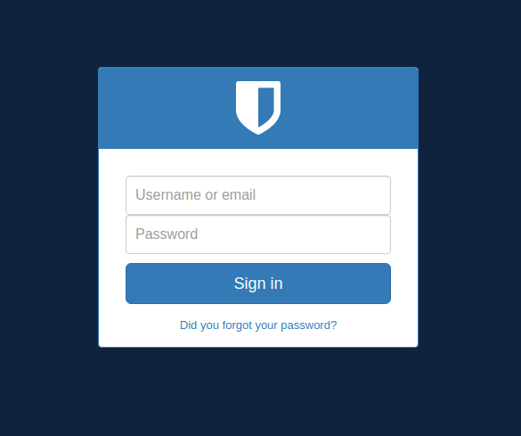

# Welcome to Wiggum

Wiggum is an open source authentication & authorization (auth) centralized system,
The aim of wiggum is to allow users to login once and authenticate in all your
aplications based on [JWT] standard and cookies. Also has an authorization system
based on permissions that applications can check with its API.

Wiggum is a Django project, if you already know how Django works then [setting up and running] will be very easy, wiggum is very easy to customize as you will see in [customization] section.

[JWT]: https://en.wikipedia.org/wiki/JSON_Web_Token
[setting up and running]: quick-start.md
[customization]: custom/introduction.md

At this moment Wiggum can do a little bit more than login and logout:

* Login
* Logout
* JWT based authentication
* User, apps & permission models and API
* Admin panel
* Login/logout endpoints
* Default theme (clancy)
* Password reset links (expiration included)
* SFA (Single factor authentication) login with a link
* Theme selector based on ID, theme name or appID
* Redirect param on important URIs like login or logout
* Dev and CI environment based on docker and docker compose
* Impersonation of users
* JWT versioning (used for invalidation)
* JWT transition keys (two valid jwt keys at a time)
* Prometheus metrics
