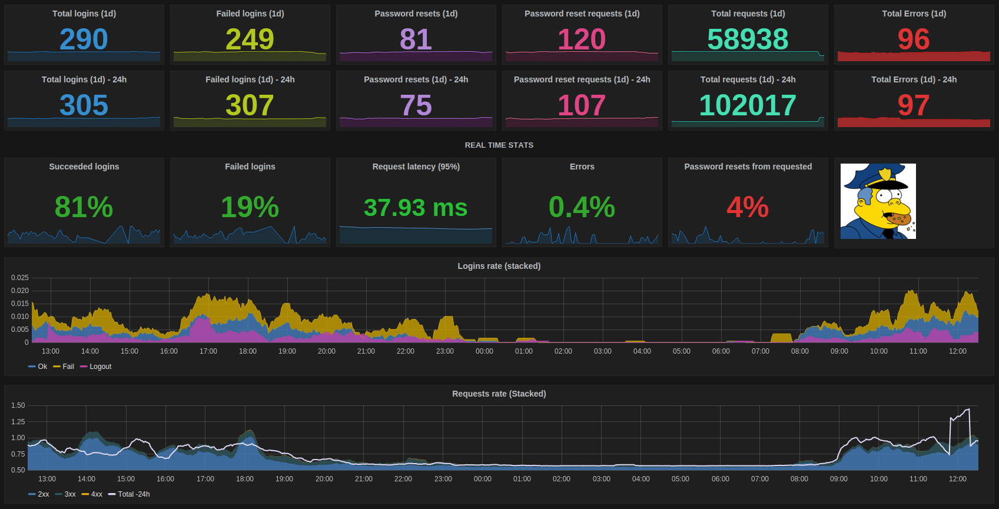

Wiggum has some common metrics for [Prometheus] system

[Prometheus]: https://prometheus.io

# Metrics endpoint

Prometheus metrics are in `/metrics` url, you should point prometheus on that
enpoint in order it can scrape wiggum metrics.

# Metrics

Wiggum uses [django-prometheus] project. So will have this project metrics, this
has metrics like request latencies, request enpodints, response codes...

Appart from this Wiggum also has custom metrics for:

- Success logins
- Failed logins
- Logouts
- Password requests
- Password resets
- Impersonations

[django-prometheus]: https://github.com/korfuri/django-prometheus

To check which ones and their names, go to `/metrics`

In this image you see a wiggum dashboard in [grafana] querying wiggum metrics
on prometheus.
[grafana]: http://grafana.org/

!!! note
    Metrics are per process so you will need to set wiggum instances as 1 process,
    If you are using these metrics you shouldn't use multiple uwsgi workers
    (if you are using uwsgi) or similar and use single workers per instance and Load
    balancers instead.
